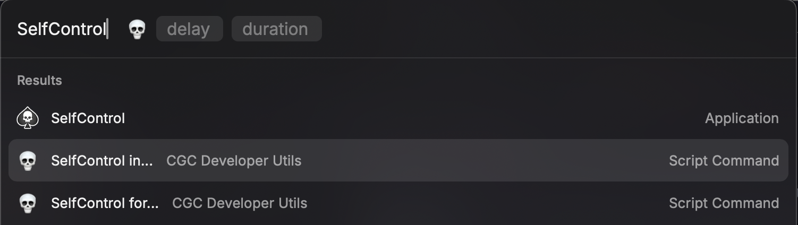

# selfcontrol-raycast

A Raycast plugin for using SelfControl, a MacOS app to block distractions. A useful tool for those of you who, like me, tend to doomscroll during election years.

*Caveat emptor!* This is a barely-tested extension for SelfControl, which can do nasty things to your computer if used improperly.

This is a light script extension for [Raycast](https://www.raycast.com/) to integrate [SelfControl](https://selfcontrolapp.com/), which will allow you to start a new SelfControl session from Raycast either immediately, or after a delay.

To add this to Raycast, clone this repository and add the directory as a Script Directory in your Raycast Extensions settings.

Requires SelfControl to run. Raycast is technically optional - you can just call the scripts directly - but recommended nonetheless.
